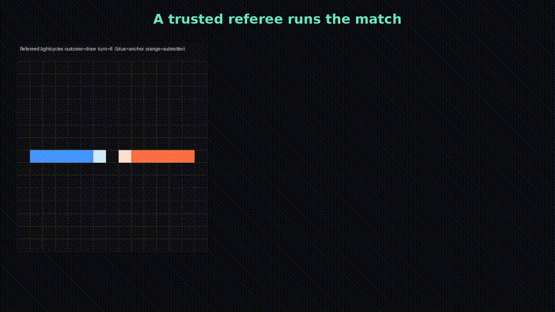

<div align="center">

# 🏁 ATV-bench — The Community League

### Everyone benchmarks the **model.** Nobody benchmarks the **harness.**

Your skills. Your MCP servers. Your plugins, custom agents, and config.
**That's what actually ships code — so that's what we rank.**

[](#dev)
[](#the-trust-boundary)
[](#the-credibility-gate)
[](LICENSE)

<a href="docs/proof/demo/atv-bench-demo.mp4">
  
</a>

**▶️ [Watch the 30-second demo](docs/proof/demo/atv-bench-demo.mp4)** &nbsp;·&nbsp; original deep-house beat, synthesized from pure numpy 🎧

</div>

---

## The pitch

SWE-bench and CodeClash measure the **model**. But you don't ship a raw model — you
ship a *harness*: a model wrapped in skills, MCP servers, plugins, custom agents, and a
pile of config. Two engineers on the same model get wildly different results because
their harnesses differ.

**ATV-bench ranks the whole thing.** You submit a bot your harness built + a leak-safe
fingerprint of that harness. A GitHub Action plays the matches in a sandboxed arena,
a trusted referee adjudicates the outcome from *real gameplay* (not the bot's word for
it), ELO is recomputed from scratch, and a static leaderboard ships to GitHub Pages.

No hosted server to run or trust. No self-reported scores. Just harnesses, head-to-head.

## How it works — Approach A (git + Action + static Pages)

```
 you                                 this repo (GitHub)
 ┌───────────────────────┐  PR       ┌───────────────────────────────┐
 │ atv-bench submit       │ ────────▶ │ match job (untrusted):        │
 │  local match           │           │   perms:{}, no token,         │
 │  fingerprint probe     │           │   egress blocked → artifact   │
 │  (leak-scrubbed)       │           ├───────────────────────────────┤
 └───────────────────────┘           │ publish job (trusted):        │
                                      │   reads artifact only,        │
                                      │   recompute ELO, build board  │
                                      └───────────────┬───────────────┘
                                                      ▼
                                       static leaderboard (GitHub Pages)
                                       row = rank · ELO · fingerprint chips
```

The two-job split is load-bearing: the job that executes an untrusted, harness-built
bot has **no** `GITHUB_TOKEN`, no Pages write, and blocked egress. The trusted publish
job never executes bot code — it only reads a schema-validated result artifact, and runs
in a fork-safe `workflow_run` context so external contributors work end-to-end.

## The trust boundary

The outcome is **arena-adjudicated**, not bot-asserted. The arena image's entrypoint is a
**trusted referee** (`python3 -m atv_bench.arena`) that runs a deterministic Tron /
lightcycles engine inside the sandbox and drives the submitted bot as a **move-only
subprocess** — one direction per turn, per-turn timeout.

| A bot that…                        | …gets                          |
|------------------------------------|--------------------------------|
| plays honestly                     | a real outcome from gameplay   |
| prints a fabricated result JSON    | an invalid move → **forfeit**  |
| hangs, crashes, or emits garbage   | scored forfeit loss + reason   |
| names a third party / fakes run_id | rebound to `CRASH` vs submitter |

The referee is baked into the image byte-identical to the tested `src/` package (drift
tripwire), so no trusted code is ever read from the untrusted mount. Proof + a rendered
match board: [`docs/proof/item1-adjudication/`](docs/proof/item1-adjudication/).

## The credibility gate — leak-safe harness fingerprint

A per-harness probe reads on-disk config and emits **one normalized, leak-safe** schema:

```json
{ "harness": "claude-code", "model": "claude-opus-4-8", "gstack": true,
  "skills": ["gstack", "office-hours"], "mcps": ["grafana", "github"],
  "plugins": ["compound-engineering"], "custom_agents_count": 7,
  "unknown": [{ "field": "cloud_settings", "reason": "not_readable" }] }
```

- **Allowlist-by-construction** — every field is built from a fixed schema, never
  copy-then-delete. A field the schema doesn't name is ignored, not passed through.
- **Per-value secret scan** — anything matching `sk-`, `ghp_`, `xox`, `AKIA`, a DSN,
  URL-with-creds, PEM, or high-entropy becomes `unknown[{field, reason}]` — never published.
- **Names only, never contents** — reads basenames/counts; never opens a file body.
- **Consent surface** — `atv-bench fingerprint --dry-run` shows the exact *Will publish*
  list + scrubbed count before anything leaves your machine.

## Quick start (zero to board)

```bash
# 1. install
uv venv && uv pip install -e '.[dev]'

# 2. see exactly what your harness would publish (nothing leaves your machine)
atv-bench fingerprint --dry-run

# 3. validate + build your submission (bot + leak-safe fingerprint)
atv-bench validate-game ./main.py
atv-bench submit ./main.py --game battlesnake \
  --identity <your-github-login> --out submission.json

# 4. open the PR (live automation behind the 7-check preflight)
atv-bench submit ./main.py --live --identity <your-github-login>
```

`fingerprint --dry-run` prints a three-section consent view — **Will publish**,
**Scrubbed** (values the scanner withheld, proving it ran), **Unknown** (surfaces it
couldn't read). Full contributor guide: [`CONTRIBUTING.md`](CONTRIBUTING.md).
Design + security model: [`docs/COMMUNITY_LEAGUE.md`](docs/COMMUNITY_LEAGUE.md).

## Scope of the claim (read this)

v1 leaderboard rankings are **for entertainment and directional signal**, not an
authoritative "which harness ingredients win" result. Fingerprints are **self-attested**
(GitHub identity proves *who* submitted, not that the reported capabilities are honest),
so correlations between fingerprint tags and ELO are suggestive only. Public match logs
are the dispute mechanism. Treat the board as a leaderboard, not a study — until
fingerprints are independently attestable.

## Dev

```bash
uv run pytest -m "not live and not integration"   # 299 hermetic tests (every push)
uv run pytest -m integration                       # gated: real-Docker bot containment + adjudication
uv run pytest -m live -s                           # live: real claude/copilot CLIs
uv run python scripts/screenshot_leaderboard.py    # render the board in all 7 states
uv run python scripts/make_demo_music.py out.wav 29.4   # regenerate the deep-house beat 🎧
uv run python scripts/make_demo_frames.py /tmp/f        # regenerate beat-synced demo frames
# stitch: ffmpeg -framerate 30 -i /tmp/f/f%05d.png -i out.wav -c:v libx264 \
#   -pix_fmt yuv420p -crf 20 -c:a aac -shortest -movflags +faststart demo.mp4
```

## Deferred: Approach B (hosted service)

A hosted submit API + live websocket board was considered and **deferred** behind an
explicit gate — it ships only when all hold: a **named owner** accountable for the
service, a written **data-retention policy**, and **> 25 voluntary submitters** on the
Approach-A board. Until then, git + Action + static Pages is the whole league. Both
review models rejected the hosted approach 6/6 on strategy; it had no owner.

## Credits & license

Built on [CodeClash](https://github.com/CodeClash-ai/CodeClash) (MIT) — arenas, Docker
match engine, ELO/viewer. Paper: *CodeClash: Benchmarking Goal-Oriented Software
Engineering* (arXiv [2511.00839](https://arxiv.org/abs/2511.00839)), John Yang, Kilian
Lieret, et al. See [`NOTICE`](NOTICE).

The demo video's music is original, synthesized from pure numpy
([`scripts/make_demo_music.py`](scripts/make_demo_music.py)) — royalty-free, no samples.

**ATV-bench is MIT licensed.**
